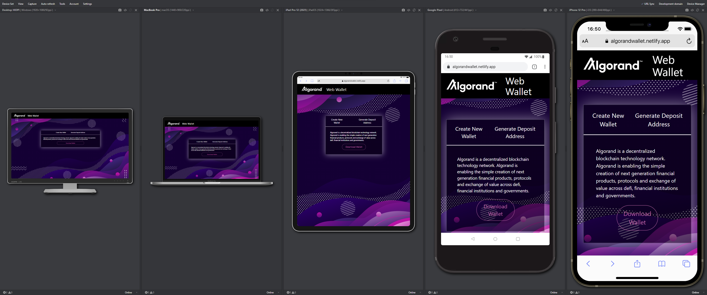

# Algorand Wallet 


## Functionality
- Create New Wallet 
- Get Donation Address 

## Tech stack:
- React, Typescript
- Tailwind

## Install
```bash
yarn # installs all dependencies
yarn start # starts the application
```

## Config
Change the Tatum API Key in the `.env` file

## Current issues
At the current stage the tatum API does not give much room for adding more futures.
As they will improve their api this application will follow along. 
